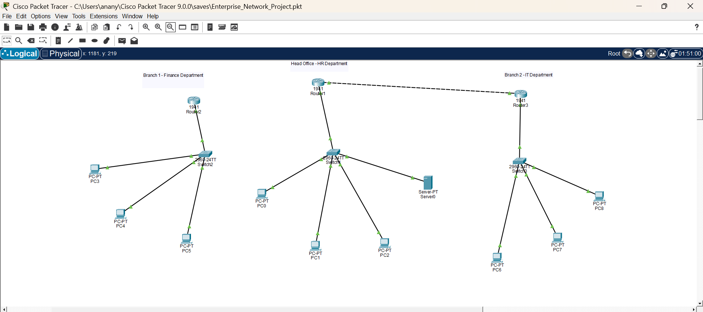

# Enterprise Network Design and Security

## Overview

This project demonstrates the design and implementation of a secure multi-site enterprise network using Cisco Packet Tracer. The network simulates a real-world organizational environment consisting of a Headquarters (HQ) and multiple Branch Offices interconnected through dynamic routing protocols.

The solution incorporates industry-standard networking technologies including VLAN segmentation, Inter-VLAN Routing, DHCP, DNS, OSPF, Access Control Lists (ACLs), and SSH-based secure device management. The architecture is designed to provide scalability, security, centralized administration, and efficient communication across network segments.

---

## Project Objectives

* Design a scalable enterprise network architecture.
* Implement VLAN-based network segmentation.
* Configure Inter-VLAN Routing using Router-on-a-Stick.
* Deploy DHCP services for automatic IP allocation.
* Configure DNS services for hostname resolution.
* Implement OSPF dynamic routing between sites.
* Enforce security policies using ACLs.
* Enable secure remote administration using SSH.
* Validate connectivity and routing through testing and troubleshooting.

---

## Network Architecture

The enterprise network consists of:

| Device      | Quantity |
| ----------- | -------- |
| Routers     | 3        |
| Switches    | 3        |
| End Devices | 12       |
| DNS Server  | 1        |

### Site Distribution

## Network Topology

**Headquarters (HQ)**

* Core Router
* Access Switch
* HR Department
* Finance Department
* IT Department
* DNS Server

**Branch Office 1**

* Router
* Switch
* End User Systems

**Branch Office 2**

* Router
* Switch
* End User Systems

---

## Technologies Implemented

### Routing & Switching

* VLAN Configuration
* Trunking
* Router-on-a-Stick
* Inter-VLAN Routing
* OSPF Dynamic Routing

### Network Services

* DHCP
* DNS

### Security

* Access Control Lists (ACLs)
* SSH Secure Remote Management
* Network Segmentation

### Fundamentals

* IPv4 Addressing
* Subnetting
* TCP/IP
* OSI Model
* Network Troubleshooting

---

## IP Addressing Plan

| Network Segment | Address Space   |
| --------------- | --------------- |
| HR VLAN         | 192.168.10.0/24 |
| Finance VLAN    | 192.168.20.0/24 |
| IT VLAN         | 192.168.30.0/24 |
| Branch Office 1 | 192.168.40.0/24 |
| Branch Office 2 | 192.168.50.0/24 |

---

## Key Features

### VLAN Segmentation

Departments are logically separated using VLANs to reduce broadcast traffic and improve security.

### Inter-VLAN Routing

Router-on-a-Stick configuration enables communication between VLANs while maintaining logical separation.

### DHCP Services

Automated IP address allocation minimizes administrative overhead and improves scalability.

### DNS Services

Hostname resolution allows users to access resources using human-readable names.

### OSPF Dynamic Routing

OSPF enables automatic route exchange between headquarters and branch locations.

### ACL Security

Traffic filtering policies restrict unauthorized communication between departments.

### SSH Management

Secure encrypted remote administration replaces insecure management protocols.

---

## Validation and Testing

The following tests were successfully completed:

| Test Scenario            | Status     |
| ------------------------ | ---------- |
| VLAN Communication       | Successful |
| Inter-VLAN Routing       | Successful |
| DHCP Address Assignment  | Successful |
| DNS Resolution           | Successful |
| OSPF Neighbor Formation  | Successful |
| OSPF Route Advertisement | Successful |
| ACL Enforcement          | Successful |
| SSH Connectivity         | Successful |

---

## Project Deliverables

* Cisco Packet Tracer Simulation File (.pkt)
* Detailed Project Documentation (.pdf)
* Configuration Screenshots
* Network Architecture Documentation
* Configuration Command Reference

---

## Skills Demonstrated

* Enterprise Network Design
* Routing & Switching
* VLAN Implementation
* OSPF Configuration
* DHCP & DNS Administration
* Network Security
* ACL Configuration
* SSH Deployment
* Troubleshooting & Verification
* Technical Documentation

---

## Author

**Ananya Chaurasia**

Bachelor of Engineering – Computer Science

Cambridge Institute of Technology North Campus

Bengaluru, India

---

*This project was developed for practical implementation of enterprise networking concepts and demonstrates hands-on experience with Cisco networking technologies commonly used in modern enterprise environments.*
